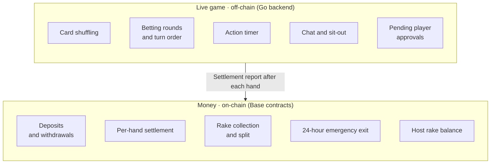

# How Stacked works

Stacked is hybrid by design: a backend runs the live game, and smart contracts on Base hold the money and settle every hand. Two systems, each doing what it's good at.

## Why a hybrid

Pure on-chain poker is slow. Every action — fold, call, raise — would need to wait for the blockchain to confirm, and the gas cost would make low-stakes play unaffordable. Pure off-chain poker is fast but asks you to trust an operator with your money.

Stacked combines them. The parts that need speed live off-chain. The parts that need trust live on-chain.

The off-chain part is a Go backend that runs the game in real time. The on-chain part is a set of smart contracts on Base (Coinbase's Ethereum-based network) — one contract per real-money table, deployed when the Host creates it.

## How the two parts talk

While you're playing, the backend tracks the state of the table: who has which cards, whose turn it is, what the pot is. None of this is on-chain. Your actions during a hand aren't signed by your wallet, and nothing is recorded to Base while the hand is in progress.

When a hand finishes, the backend sends a settlement transaction to the table's contract. The contract receives the report — who won, how much, what rake to take — and updates everyone's seat balances on-chain. **The contract is the source of truth for money; the backend is the source of truth for gameplay.**

If they ever disagree on a balance, the contract wins.

## What this means for trust

The backend can:

- Run the game incorrectly (in theory) — though hand outcomes are deterministic from the cards and actions; bugs would show up immediately.
- Submit bad settlement reports — but the contract validates them, and the 24-hour emergency exit gives you an unconditional way out if anything goes wrong.

The backend can't:

- Move your money. Funds sit in the contract, and the backend doesn't have the keys to override the contract's rules.
- Hold your stack against your will. Once you leave the table, the contract grants you withdrawal permission and only your signature releases the funds.

This is the trade-off: you trust Stacked to run the game fairly, but not to hold your money. The on-chain part is what makes that distinction enforceable instead of a promise.

## What's on-chain that you can verify

- The table contract for any real-money table you play at. Read the code on Basescan.
- Every settlement transaction. Each hand's outcome is a transaction you can pull up.
- Your deposit and withdrawal transactions. Visible from your wallet's transaction history.

## What's next

- [How custody works →](/docs/your-money/custody) — the contract side of the system in detail.
- [Per-hand settlement →](/docs/your-money/settlement) — what happens on-chain after each hand.
- [Security & contracts →](/docs/about/security) — audit status, RNG model, source verification.
