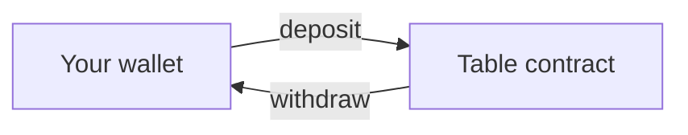

# How Stacked works

Stacked is hybrid by design: Stacked's servers run the live game, and smart contracts on Base hold the money and settle every hand. Two systems, each doing what it's good at.

A smart contract is a program that runs on a blockchain and holds funds under fixed rules. Base is an Ethereum-based network with very low fees. USDC is a digital dollar that holds a stable value.

## Why a hybrid

Pure on-chain poker is slow. Every action — fold, call, raise — would need to wait for the blockchain to confirm, and the gas cost (the small network fee to record something on-chain) would make low-stakes play unaffordable. Pure off-chain poker is fast but asks you to trust an operator with your money.

Stacked combines them. The parts that need speed run on Stacked's servers. The parts that need trust live on-chain.

The live game — card shuffling, betting rounds, turn order, the action timer, chat, and Host approvals — runs on Stacked's servers in real time. The money lives on-chain: one smart contract per real-money table, deployed on Base when the Host creates it. That contract holds your USDC, settles every hand, and gives you a 24-hour emergency exit.

Your own money flows in a simple loop:

```mermaid
flowchart LR
    W[Your wallet] -- deposit --> C[Table contract]
    C -- withdraw --> W
```

## How the two parts fit together

While you're playing, Stacked's servers track the state of the table: who has which cards, whose turn it is, what the pot is. None of this is on-chain. Your actions during a hand aren't signed by your wallet, and nothing is recorded to Base while the hand is in progress.

When a hand finishes, it settles on the table's contract: the chip movements are recorded on-chain and everyone's seat balances update. Settlement is fast — under 5 seconds on Base — and runs in the background, so it never interrupts play. You pay no gas for it; Stacked covers that cost. **The contract is the source of truth for money; Stacked's servers are the source of truth for gameplay.**

If they ever disagree on a balance, the contract wins.

## What this means for trust

Stacked's servers can:

- Run the game incorrectly (in theory) — though hand outcomes are deterministic from the cards and actions; bugs would show up immediately.
- Settle a hand wrong (in theory) — but the contract enforces its own rules, and the 24-hour emergency exit gives you an unconditional way out if anything goes wrong.

Stacked's servers can't:

- Move your money. Funds sit in the contract, and Stacked doesn't have the keys to override the contract's rules.
- Hold your stack against your will. Once you leave the table, the contract grants you withdrawal permission and only your signature releases the funds.

This is the trade-off: you trust Stacked to run the game fairly, but not to hold your money. The on-chain part is what makes that distinction enforceable instead of a promise.

## What's on-chain that you can verify

- The table contract for any real-money table you play at. Read the code on Basescan.
- Every settlement transaction. Each hand's outcome is a transaction you can pull up.
- Your deposit and withdrawal transactions. Visible from your wallet's transaction history.

## What's next

- [How custody works →](/docs/your-money/custody) — the contract side of the system in detail.
- [Per-hand settlement →](/docs/your-money/settlement) — what happens on-chain after each hand.
- [Security & contracts →](/docs/about/security) — audit status, RNG model, source verification.
