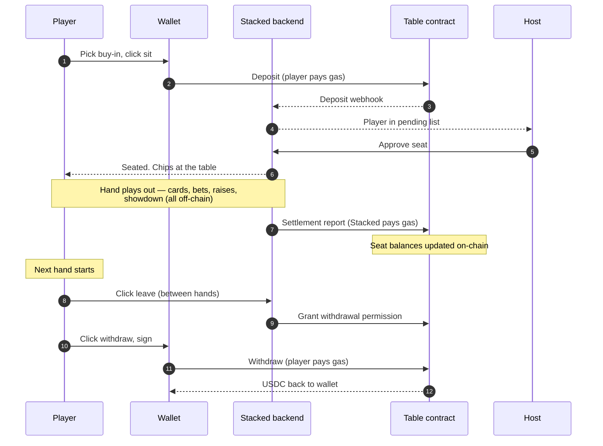

# How a hand of Stacked works

A walkthrough of a single real-money hand from creating the table to cashing out, with specific names and numbers.

## The setup

**Alice** decides to host a table. She connects her wallet, clicks create, picks $0.50 / $1 stakes, sets the mode to real-money, and makes the table public. Stacked deploys a new smart contract for the table on Base — Alice doesn't pay gas; Stacked covers the deployment.

**Bob** is browsing the lobby. He spots Alice's table, sees the stakes match what he wants to play, and clicks sit. He picks a $100 buy-in. His wallet pops up; he signs the deposit. A few seconds later the contract holds his 100 USDC, and Bob appears in Alice's pending list. Alice approves; Bob is seated with 10,000 chips in front of him (1 chip = $0.01).

**Carol** does the same: $100 buy-in, Alice approves, seated with 10,000 chips.

Alice doesn't have to play to earn — as soon as hands start running, she earns 25% of the rake on every pot. She decides to play too: she takes a seat at her own table, buys in for $100, and the table is three-handed.

## The hand

Bob is on the button this hand. Carol posts the small blind ($0.50); Alice posts the big blind ($1).

Everyone gets two hole cards. Bob raises to $3. Carol folds. Alice calls.

**Flop:** K♠ 7♦ 2♥. Alice checks. Bob bets $5. Alice calls.

**Turn:** K♥. Alice checks again. Bob bets $12. Alice raises to $30. Bob calls.

**River:** 3♣. Alice goes all-in for the rest of her stack. Bob calls.

**Showdown:** Alice turns over K♣ Q♣ — three kings, queen kicker. Bob turns over K♦ J♦ — three kings, jack kicker. Alice wins the pot.

None of that hand was on-chain. The backend was running it in real time. No wallet prompts, no transactions, no gas — for any of the three players.

## Settlement

The hand ends. The backend sends a settlement transaction to the table contract:

- Alice's stack goes up by the pot, minus the rake.
- Bob's stack goes down by what he lost.
- Carol's stack is down by her posted small blind.
- Rake is taken from the pot. 25% of the rake credits to Alice's Host balance; 75% goes to the platform. (See [How rake works](/docs/your-money/rake) for the math.)

The transaction confirms on Base in around a second. By the time the next hand is being dealt, everyone's on-chain seat balance matches what they see at the table. Stacked covers the gas for the settlement; nobody at the table pays anything for it.

If anyone wants to audit the result, the settlement transaction is visible on Basescan from the table's contract activity.

## Leaving

A few hands later, Bob decides he's done. He clicks leave between hands. The contract grants him withdrawal permission. Bob clicks withdraw, signs the transaction from his wallet, and his current stack moves from the contract back to his wallet as USDC. He pays the Base gas on this — typically under a cent.

Carol keeps playing. Alice keeps hosting, with her Host rake balance growing as hands settle. When she's ready, she'll withdraw it the same way Bob withdrew his stack.

## What you saw

A few things worth noticing:

- **Nothing was on-chain while the hand was in progress.** Cards, bets, raises, the showdown — all backend. Wallet prompts only at the start (deposit) and the end (withdrawal).
- **The contract is the source of truth for money.** Every player's stack matches the on-chain seat balance after every hand. If the backend disagreed with the contract, the contract would win.
- **It's fast.** Settlement was sub-second. Gameplay isn't slowed down by being on-chain.
- **Stacked covers the gas where it shouldn't be friction.** Table deployment, settlement: on us. Deposits, withdrawals: on you, because you sign them.
- **Alice earned the whole time.** A Host's 25% share of the rake credits per hand, live, whether or not the Host plays. Multiply by hundreds of hands and that's the hosting side of Stacked.

That's a hand. Multiply by hundreds and the only thing that changes is the cards.

## What's next

- [Per-hand settlement →](/docs/your-money/settlement) — what the contract is actually doing between hands.
- [How custody works →](/docs/your-money/custody) — the bigger picture of the contract that held the money.
- [Hosting a table →](/docs/hosting/overview) — if you want to be Alice.
