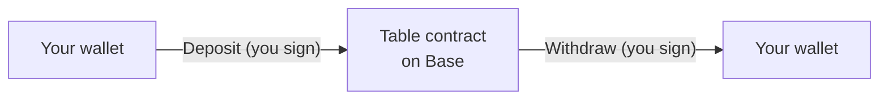

# How custody works

Your USDC on Stacked sits in a smart contract on Base — not in a Stacked-controlled account.

## What holds your money

Every real-money table on Stacked is its own smart contract, deployed to Base (Coinbase's Ethereum-based network) when the Host creates the table. When you sit down, your buy-in moves into that table's contract. When you leave, it moves back to your wallet. While you're playing, every settled hand updates your seat balance inside the contract.

Each hand settles *inside* the contract — your seat balance updates on-chain after every hand played.

A few practical consequences:

- **Stacked itself never holds your money.** It sits in the contract; only the contract's rules can move it.
- **One contract per table.** If you play at three real-money tables, your funds are held across three separate contracts. Leaving one doesn't affect any other.
- **Free Play has no contract.** Play-money chips aren't tracked on-chain. Only real-money tables involve a contract.

## What the contract can and can't do

The contract's logic is fixed at deployment. No party — including Stacked — can change a deployed table's rules.

**The contract can:**

- Accept your deposit when you sit down.
- Update seat balances after each hand based on what the backend reports.
- Take rake on each pot and split it between the platform and the Host.
- Release your stack back to your wallet when you withdraw.
- Release your stack via the [emergency exit](/docs/your-money/emergency-exit) if settlement stalls for 24 hours.

**The contract cannot:**

- Send your funds anywhere except back to your wallet, the platform fee recipient, or the Host's rake balance.
- Change the rake schedule on its own.
- Hold your money against your will once you've left or after the 24-hour emergency window unlocks.
- Be edited after deployment. The contract has no admin override and no upgrade hook — what was deployed runs forever, exactly as deployed.

## Who does what

Three parties touch a real-money table. Each has a defined and limited role:

| Party | What they can do | What they can't do |
|---|---|---|
| **You (player)** | Deposit, play, withdraw, emergency-exit after 24h | Move another player's funds; change table rules |
| **Host** | Approve players, kick, change stakes between hands, pause or end the table, withdraw rake | Move any player's stack; settle hands; change the rake schedule |
| **Stacked** | Run the game off-chain, submit settlement transactions to the contract, deploy and operate new tables | Custody player funds; bypass withdrawal permissions; settle hands without the contract recording them |

Stacked's role is operational. The backend runs the game and reports each hand's outcome to the contract. The contract applies the report and moves chips between seat balances. Stacked's settlement wallets can move chips around inside the contract; they can't redirect them anywhere outside the contract's rules.

## Code and contracts

Stacked's table contracts are deployed and source-verified on [Basescan](https://basescan.org), so the actual code each contract runs is readable on the block explorer. We don't currently maintain a public GitHub repo for the contracts — that may change later.

The contracts are intentionally simple: short functions, narrow deposit and withdrawal paths, no admin override, no upgrade mechanism. They have extensive unit-test coverage. **An external audit is on the roadmap and not yet complete.** Until that audit lands, the trust story rests on three things: testing, simplicity, and the 24-hour emergency exit.

If you want to see the code for a specific table, open its contract address on Basescan and read it directly.

## Contract addresses

Production contracts on Base mainnet.

| Contract | Address |
|---|---|
| Factory | _coming soon_ |
| USDC (token) | [`0x833589fCD6eDb6E08f4c7C32D4f71b54bdA02913`](https://basescan.org/address/0x833589fCD6eDb6E08f4c7C32D4f71b54bdA02913) |

Per-table contracts are deployed on demand when a Host creates a table. Each table's contract address is visible in the table's settings.

## What's next

- [24-hour emergency exit →](/docs/your-money/emergency-exit) — the safety net behind on-chain custody.
- [Per-hand settlement →](/docs/your-money/settlement) — what happens on-chain after every hand.
- [Deposits →](/docs/your-money/deposits) and [Withdrawals →](/docs/your-money/withdrawals) — the ordinary paths in and out.
