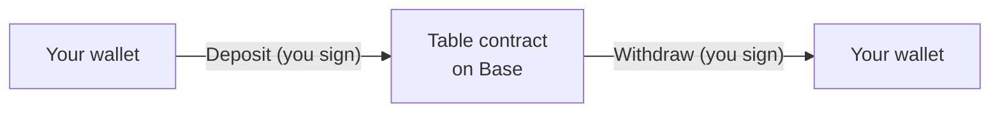

# How custody works

Your USDC — a digital dollar that holds a stable value — sits in a smart contract on Base, not in a Stacked-controlled account. A smart contract is a small program that lives on-chain and can only do what its code allows.

## What holds your money

Every real-money table on Stacked is its own smart contract, deployed to Base (an Ethereum-based network with very low fees) when the Host creates the table. When you sit down, your buy-in moves into that table's contract. When you leave, it moves back to your wallet. While you're playing, every settled hand updates your seat balance inside the contract.

```mermaid
flowchart LR
    W1[Your wallet] -- "Deposit (you sign)" --> C["Table contract<br/>on Base"]
    C -- "Withdraw (you sign)" --> W2[Your wallet]
```

Each hand settles *inside* the contract — your seat balance updates on-chain after every hand played.

A few practical consequences:

- **Stacked itself never holds your money.** It sits in the contract; only the contract's rules can move it.
- **One contract per table.** If you play at three real-money tables, your funds are held across three separate contracts. Leaving one doesn't affect any other.
- **Free Play has no contract.** Play-money chips aren't tracked on-chain. Only real-money tables involve a contract.

## What the contract can and can't do

The contract's logic is fixed at deployment. No party — including Stacked — can change a deployed table's rules.

**The contract can:**

- Accept your deposit when you sit down.
- Update seat balances on-chain after each hand.
- Release your stack back to your wallet when you withdraw.
- Release your stack via the [emergency exit](/docs/your-money/emergency-exit) if settlement stalls for 24 hours.

**The contract cannot:**

- Send your funds anywhere outside its own rules — your stack only ever returns to your wallet.
- Change the platform fee schedule on its own.
- Hold your money against your will once you've left or after the 24-hour emergency window unlocks.
- Be edited after deployment. The contract has no admin override and no upgrade hook — what was deployed runs forever, exactly as deployed.

## Who does what

Three parties touch a real-money table. Each has a defined and limited role:

| Party | What they can do | What they can't do |
|---|---|---|
| **You (player)** | Deposit, play, withdraw, emergency-exit after 24h | Move another player's funds; change table rules |
| **Host** | Approve players, kick, change stakes between hands, pause or end the table, withdraw the platform fee | Move any player's stack; change the platform fee schedule |
| **Stacked** | Run the live game, deploy and operate new tables | Custody player funds; bypass withdrawal permissions; move funds outside the contract's rules |

There are two systems at work, each doing what it's good at: Stacked runs the game — dealing, betting, turn order — while the on-chain contract holds the money and records each hand's result. Stacked can move chips between seat balances inside the contract as hands settle, but it can never redirect them anywhere outside the contract's rules.

## Code and contracts

Stacked's table contracts are deployed and source-verified on [Basescan](https://basescan.org), so the actual code each contract runs is readable on the block explorer. We don't currently maintain a public GitHub repo for the contracts — that may change later.

The contracts are intentionally simple: short functions, narrow deposit and withdrawal paths, no admin override, no upgrade mechanism. They have extensive unit-test coverage. **An external audit is on the roadmap and not yet complete.** Until that audit lands, the trust story rests on three things: testing, simplicity, and the 24-hour emergency exit.

If you want to see the code for a specific table, open its contract address on Basescan and read it directly.

## Contract addresses

Each real-money table's own contract address is shown in that table's settings — open it on Basescan to read the code. A single canonical list of Stacked's contracts will be published once they're finalized.

## What's next

- [24-hour emergency exit →](/docs/your-money/emergency-exit) — the safety net behind on-chain custody.
- [Per-hand settlement →](/docs/your-money/settlement) — what happens on-chain after every hand.
- [Deposits →](/docs/your-money/deposits) and [Withdrawals →](/docs/your-money/withdrawals) — the ordinary paths in and out.
