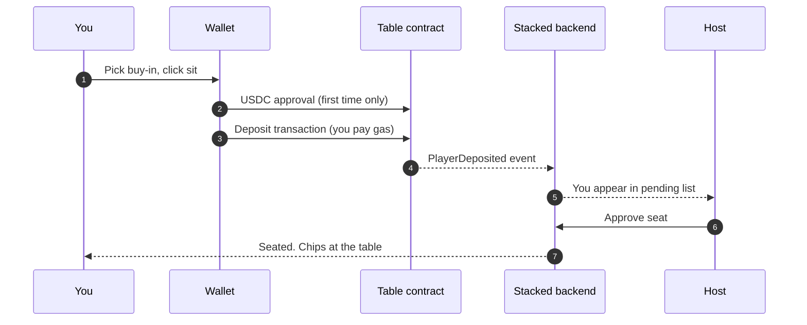

# Deposits

A deposit is how you move USDC from your wallet into a real-money table so you can sit down.

## What you need

- A connected wallet — any thirdweb-supported wallet (Coinbase Wallet, MetaMask, Rainbow, WalletConnect, and others), or the embedded wallet Stacked creates for you if you don't have one.
- USDC on Base in that wallet. Stacked doesn't yet have a built-in way to buy USDC; for now you'll need to bring it. _Onramp coming._
- A small amount of ETH on Base to cover gas for the deposit transaction. Gas on Base is typically under a cent.

## How depositing works

When you click sit at a real-money table:

1. **Pick your buy-in.** You choose how much USDC you want to put on the table, within whatever the contract allows for that table.
2. **Sign the transaction.** Your wallet pops up to confirm the deposit. The first time you deposit at a specific table, your wallet may ask you to authorize USDC spending first — a one-time approval that's standard for any app that handles USDC. After that, subsequent deposits to the same table need only the deposit signature.
3. **Wait for confirmation.** The deposit confirms on Base in a few seconds.
4. **Wait for Host approval.** Once your deposit is on-chain, you appear in the Host's pending list with your wallet and buy-in. The Host approves or declines.
5. **Sit down.** When the Host approves, you're seated and your chips show up at the table.

You pay the gas on the deposit transaction because it's a transaction you sign. Settlement gas (after each hand once you're seated) is on Stacked.

## If the Host declines

If the Host declines your seat or doesn't get to it, you don't lose your USDC. The contract grants you withdrawal permission and you can click withdraw to pull your deposit back to your wallet. Same flow as any normal withdrawal — see [Withdrawals](/docs/your-money/withdrawals).

Stacked never moves your funds without your signature. If your seat doesn't happen, your money waits in the contract until you click to retrieve it.

## What's next

- [Withdrawals →](/docs/your-money/withdrawals) — moving USDC back out of a table.
- [Joining a table →](/docs/playing/joining-a-table) — the full lobby and seating flow.
- [How custody works →](/docs/your-money/custody) — what the table contract holds and how.
