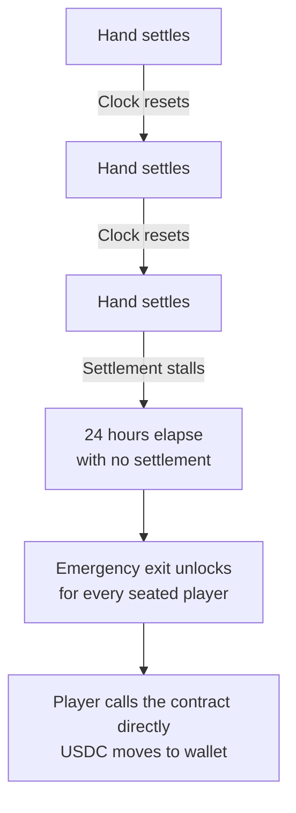

# 24-hour emergency exit

If a settlement at your table ever stalls for 24 hours, you can withdraw your stack from the contract yourself — no support ticket, no permission from anyone, just you and the contract.

## What it is

Every real-money table on Stacked is its own smart contract on Base. The contract is supposed to settle every hand within seconds. If that ever fails — Stacked's backend goes down, settlement transactions get stuck, RPC providers misbehave, anything — the contract has a fallback built in:

**24 hours after the last successful settlement, any player at the table can call a function on the contract that releases their current stack directly back to their wallet.**

This is the safety net behind the whole on-chain custody story. You don't have to take our word for it that your money is safe; the contract is what makes it safe, and the emergency exit is what makes that real.

## When the clock starts

The 24-hour clock resets every time a hand settles successfully on-chain at your table. As long as hands keep settling, the clock keeps resetting and the emergency exit is dormant.

If something goes wrong and settlements stop — for any reason — the clock starts on the last successful one. Once 24 hours have passed without another, the emergency exit unlocks for every player seated at the table.

## How to use it

Open the table's **Settings → Players** tab. Once the 24-hour window has elapsed without a settlement, an emergency-withdraw option appears there. Click it, sign the transaction from your wallet, and the contract releases your current stack back to your wallet.

Stacked's backend isn't involved in this step. The contract handles it on its own — even if our app is unreachable, the contract function is publicly callable from any wallet tool, so your funds are still accessible. You don't need our cooperation for the emergency exit to work.

## What you get back

Your current stack at the stalled table. The amount is whatever was last settled into your seat balance before settlements stopped — so the protection is exactly as good as the most recent successful settlement, which under normal operation is the last hand you played.

This is single-table: emergency-exiting at one table doesn't touch any other table you're seated at. If you're stalled at one and playing normally at another, only the stalled one's emergency exit unlocks.

## What happens to the table

Once an emergency exit happens, that's typically the end of the table. Players retrieve their stacks, the table closes out, and Stacked works through whatever caused the stall before opening a new one.

## When you'd actually need this

In normal operation, you wouldn't. Settlements happen every hand and the clock never gets near 24 hours. The emergency exit exists for the edge cases — outages, infrastructure failures, anything that could otherwise leave your money inaccessible. It's a safety net you hopefully never reach for. The point is that it's always there.

## What's next

- [How custody works →](/docs/your-money/custody) — the full picture of how the table contract holds your money.
- [Per-hand settlement →](/docs/your-money/settlement) — what's supposed to happen on every hand.
- [Withdrawals →](/docs/your-money/withdrawals) — the ordinary withdrawal flow.
