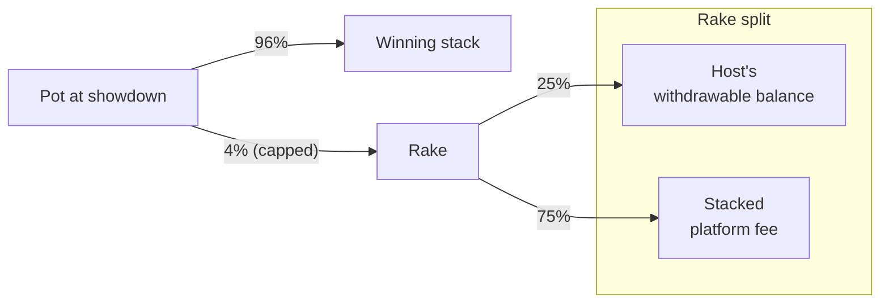

# How rake works

Rake is the small fee Stacked takes from each real-money pot to keep the platform running.
## The basics

On every real-money hand, **4% of the pot is taken as rake** when the hand settles. Rake comes out of the pot itself — it's not added on top of bets, and players don't pay it as a separate line item. Free Play tables have no rake.

The 4% is **capped per hand**, with the cap scaling to the table's big blind. The cap keeps a single large pot at high stakes from generating disproportionate rake.

## The cap

Each real-money table falls into one of five tiers based on its big blind. The cap on rake per hand is a multiple of that big blind:

| Big blind | Cap per hand |
|-----------|--------------|
| ≤ $0.25 | 10× the big blind |
| ≤ $1 | 5× the big blind |
| ≤ $2 | 3× the big blind |
| ≤ $5 | 1× the big blind |
| over $5 | 0.5× the big blind |

A worked example: a $0.50 / $1 table sits in the second tier (BB ≤ $1), so the cap is 5 × $1 = $5 per hand. A $40 pot at that table generates $1.60 of rake — under the cap, so $1.60 is what's taken. A $200 pot would generate $8 of rake at 4%, but the cap kicks in and only $5 is taken.

These numbers reflect the current defaults. Stacked can tune the rate and cap structure over time as we calibrate; if anything changes meaningfully, this page updates with it.

## How the rake is split

Every dollar of rake splits two ways:

- **25% goes to the Host** of the table — credited to the Host's withdrawable balance at that table's contract. See [Hosting earnings](/docs/hosting/earnings).
- **75% goes to Stacked** as the platform fee.

## Variations

There's one rake schedule today, applied uniformly to every real-money table. We may add promotional rake-free periods, discounts, or special table types in the future. When we do, we'll document them here.

## Free Play

Free Play tables don't generate rake. No platform fee, no Host earnings — Free Play exists for trying things out and playing with friends, not for revenue.

## What's next

- [Hosting earnings →](/docs/hosting/earnings) — the Host's 25% share, in detail.
- [Per-hand settlement →](/docs/your-money/settlement) — what happens on-chain after each hand.
