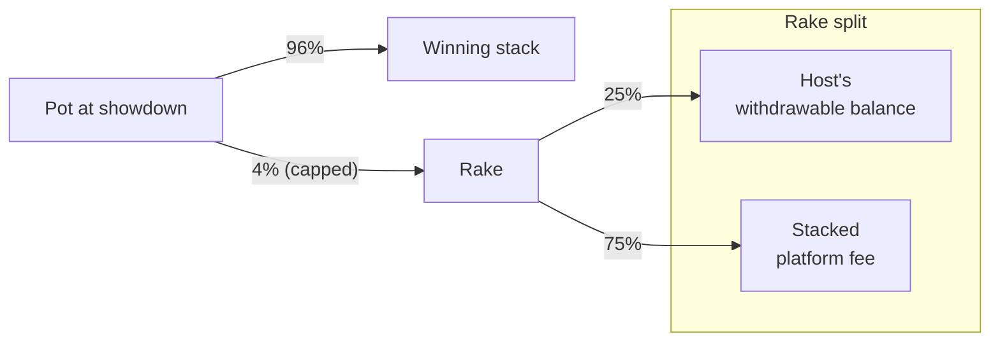

import RakeCapCalculator from '@site/src/components/RakeCapCalculator';

# How rake works

Rake is the small fee Stacked takes from each real-money pot to keep the platform running.

## The basics

On every real-money hand, **4% of the pot is taken as rake** when the hand settles. Rake comes out of the pot itself — it's not added on top of bets, and players don't pay it as a separate line item. Free Play tables have no rake.

The 4% is **capped per hand**. The cap scales with the table's big blind so a single oversized pot at high stakes doesn't generate disproportionate rake. There's also a short-handed discount: heads-up and 3–4-handed tables pay less than full ring.

## Why a curve, not fixed tiers

On Stacked, **the Host picks the small blind and big blind freely when they create a table** — there's no fixed list of stakes to choose from. A traditional poker room can publish a tier schedule ($0.50 / $1, $1 / $2, $2 / $5, etc.) because the room defines those stakes. We can't: a Host might run $0.07 / $0.15, $0.40 / $0.80, or anything else they like.

So instead of bucketing tables into tiers, the cap is a **smooth curve** that produces a sensible cap for any big blind a Host can set. Two tables with neighbouring big blinds end up with neighbouring caps — no cliffs at tier boundaries, no arbitrage from creating a table just under a tier line.

## The cap, expressed in big blinds

The cap is published as a **multiple of the big blind**, the same unit poker players already think in. The multiplier is large at micro-stakes (where small caps would feel oppressive relative to a typical pot) and tapers as stakes climb.

Here's the cap at common big-blind values, broken out by table size. The short-handed columns apply the discount described in the next section.

| Big blind | Full ring (5+) | Short-handed (3–4) | Heads-up (2) |
|---|---|---|---|
| $0.10   | 13.00× BB        | 6.50× BB         | 4.42× BB |
| $0.25   | 9.34× BB         | 4.67× BB         | 3.18× BB |
| $0.50   | 6.56× BB         | 3.28× BB         | 2.23× BB |
| $1.00   | 3.79× BB         | 1.90× BB         | 1.29× BB |
| $2.00   | 2.00× BB         | 1.00× BB         | 0.68× BB |
| $5.00   | 1.20× BB         | 0.60× BB         | 0.41× BB |
| $10.00+ | 0.60× BB and lower | 0.30× BB and lower | 0.20× BB and lower |

The cap is also bounded in absolute terms: it never falls below **$0.01** and never rises above **$6.00** per hand, regardless of the big blind.

## Calculator

Plug in any big blind to see the cap for that table. Caps are shown as a multiple of the big blind so you can compare across stakes at a glance.

<RakeCapCalculator />

## Short-handed discount

Pots are smaller when fewer players see the flop, so the cap is reduced at short-handed tables:

| Players at the table | Cap multiplier |
|---|---|
| 2 (heads-up) | 34% of the full cap |
| 3 or 4 | 50% of the full cap |
| 5 or more | full cap |

So at a $0.05 / $0.10 table, the full-ring cap is 13× BB; three- or four-handed it's about 6.5× BB; heads-up it's about 4.4× BB.

## Worked example

A $0.50 / $1 table is running six-handed. The full-ring cap there is about 3.79× BB (≈ $3.79), and with 6 players seated the full cap applies.

- A $40 pot generates 4% = $1.60 of rake. That's under the cap, so $1.60 is taken. The Host's share is $0.40; Stacked's share is $1.20.
- A $200 pot would generate $8 of rake at 4%, but the cap kicks in and only **$3.79** is taken. The Host's share is about $0.95.

If that same table drops to three players for a stretch, the cap halves to about 1.9× BB for those hands.

## How the rake is split

Every dollar of rake splits two ways. The Host's share is the structural piece that makes the marketplace work — without it, there's no reason to run a public table.

- **25% goes to the Host** of the table — credited to the Host's withdrawable balance at that table's contract. See [Hosting earnings](/docs/hosting/earnings).
- **75% goes to Stacked** as the platform fee.

## Variations

There's one rake schedule today, applied uniformly to every real-money table. The rate, the cap curve, and the short-handed discounts are all tunable — Stacked may adjust them over time as we calibrate. If anything changes meaningfully, this page updates with it. We may also add promotional rake-free periods, discounts, or special table types in the future; those will be documented here when they exist.

## Free Play

Free Play tables don't generate rake. No platform fee, no Host earnings — Free Play exists for trying things out and playing with friends, not for revenue.

## What's next

- [Hosting earnings →](/docs/hosting/earnings) — the Host's 25% share, in detail.
- [Per-hand settlement →](/docs/your-money/settlement) — what happens on-chain after each hand.
