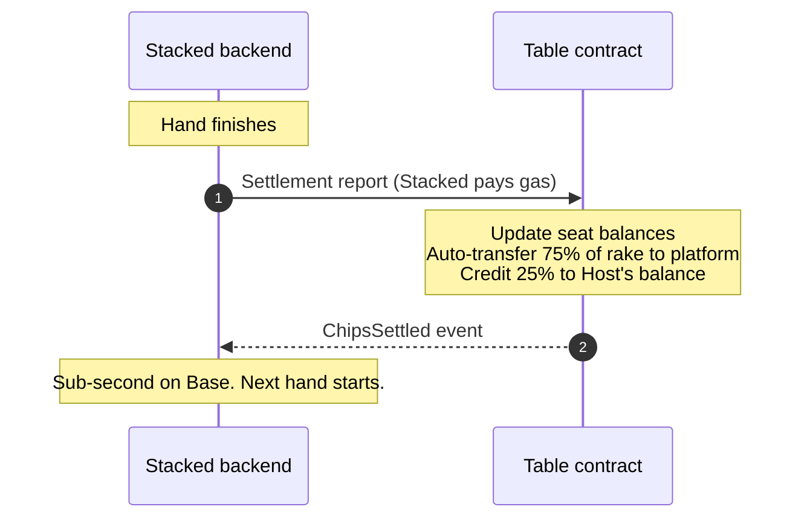

# Per-hand settlement

Every real-money hand on Stacked settles on-chain when it ends — not at the end of the session, not in a daily batch.

## What gets settled

After each real-money hand finishes, the contract for that table receives a settlement transaction summarizing what happened. The transaction:

The transaction:

- Updates every seated player's chip balance to reflect the hand's outcome.
- Takes the rake from the pot and splits it between the Host's withdrawable balance and the platform. (See [How rake works](/docs/your-money/rake) for the math.)

The on-chain record is the source of truth. Whatever stack you see in front of you at the table matches what the contract holds in your seat balance — they update together, hand by hand.

## How it feels

In normal operation, settlement is invisible. The next hand begins as soon as the previous one is done, and the on-chain transaction goes out in the background. Settlement is typically sub-second on Base (Coinbase's Ethereum-based network), depending on network conditions, so by the time you're ready to act on the next hand it's already on-chain.

You don't pay any gas for any of this — Stacked covers settlement gas on every hand. The only gas you pay at the table is when you sign your own deposit or withdrawal.

## If a settlement is slow or fails

Settlement transactions can occasionally be slow — network congestion or other transient issues, the kind of thing that happens on any blockchain. The backend retries with backoff. If retries keep failing, the table pauses between hands and Stacked works through whatever's wrong.

If settlements stay stuck for too long, the [24-hour emergency exit](/docs/your-money/emergency-exit) takes over. Settlement and emergency exit are the two halves of the same guarantee: settlement is what happens normally; emergency exit is what's there if "normally" ever breaks.

## Verifying a settlement

Every settlement is an on-chain transaction. You can see each one on the table's contract activity on Basescan if you ever want to verify a specific hand's outcome.

## What's next

- [How custody works →](/docs/your-money/custody) — what the contract holds and what it can do.
- [24-hour emergency exit →](/docs/your-money/emergency-exit) — the safety net behind settlement.
- [How rake works →](/docs/your-money/rake) — what gets taken on each pot.
