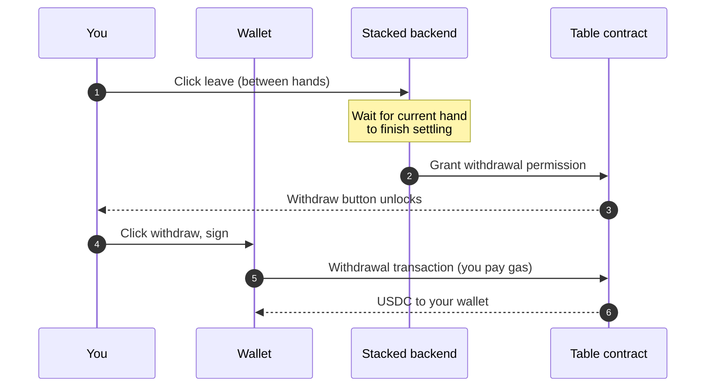

# Withdrawals

A withdrawal moves USDC from a real-money table contract back to your wallet.

## How it works

There are two steps. First, you leave the table — between hands. Second, you sign a withdrawal transaction and the contract releases your stack to your wallet.

1. **Leave the table.** Click leave at the table between hands. You can't leave mid-hand; you finish the current hand first. The contract notes that you're no longer seated and grants you permission to withdraw.
2. **Click withdraw.** Sign the transaction from your wallet. The contract sends your stack directly to your wallet — no queue, no Stacked approval, no schedule. The amount is exactly your seat balance at the moment you left.

You pay the gas on the withdrawal — it's a transaction you sign. Gas on Base is typically under a cent.

## Other ways you end up withdrawing

The same withdraw step is what you use any time a contract is holding your money for you:

- **You leave a table voluntarily.** The standard case above.
- **The Host kicks you between hands.** Same flow — you get permission, you click withdraw.
- **The Host ends the table.** Every seated player gets permission to withdraw their stack.
- **The Host declined your seat after you deposited.** Your deposit waits in the contract until you click withdraw. See [Deposits](/docs/your-money/deposits).
- **The 24-hour emergency exit unlocks.** A separate path for the rare case settlement stalls — see [24-hour emergency exit](/docs/your-money/emergency-exit).

In every case, **Stacked never moves your funds without your signature.** Whether you left, got kicked, the table closed, or you're emergency-exiting, the final click is always yours.

## Why between-hands only

A withdrawal is the contract releasing your seat balance. The seat balance is whatever was last settled on-chain — which is updated at the end of each hand. Waiting until the current hand finishes makes sure the contract knows the correct balance to release; it isn't a Stacked policy decision, it's just how the contract sees things.

## What's next

- [Deposits →](/docs/your-money/deposits) — moving USDC into a table.
- [How custody works →](/docs/your-money/custody) — what the contract holds and how.
- [24-hour emergency exit →](/docs/your-money/emergency-exit) — the safety net if settlement stalls.
